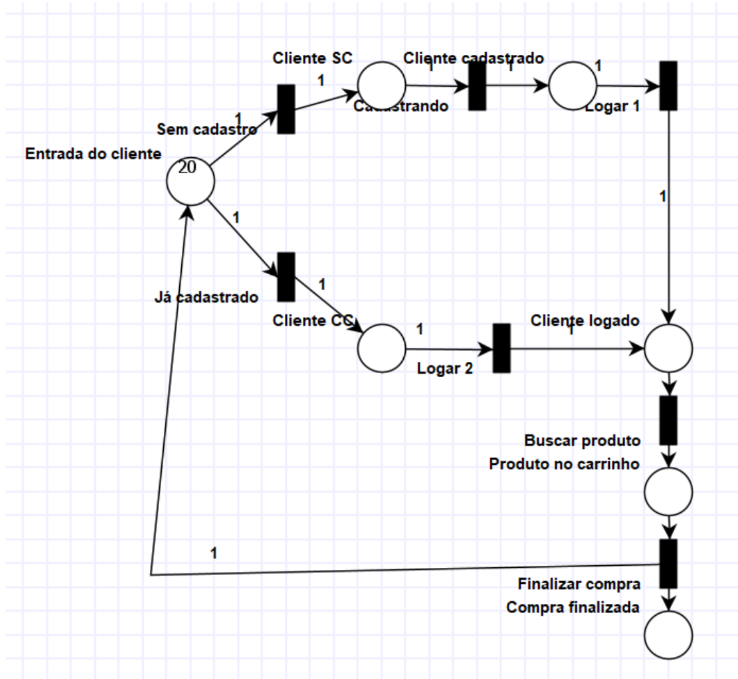
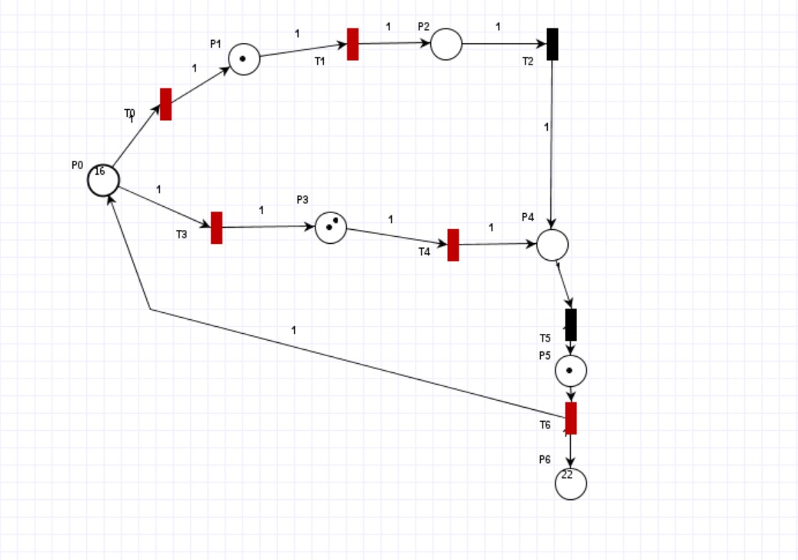
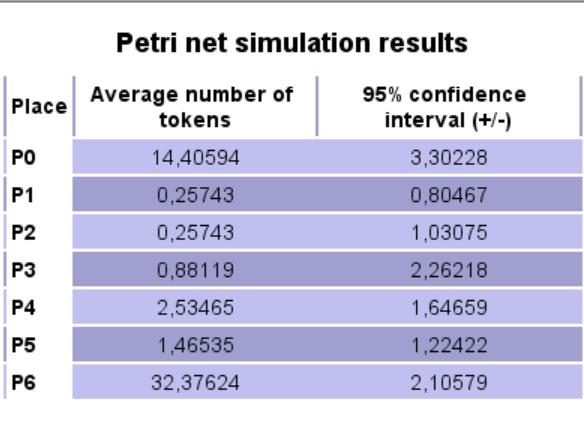

# Análise de Fluxos em Redes de Petri (PIPE)

Este documento tem como objetivo analisar os fluxos gerados a partir de uma simulação em rede de Petri, utilizando o software PIPE. As redes de Petri são ferramentas poderosas para modelar sistemas dinâmicos e permitir a análise de seu comportamento ao longo do tempo. Este relatório aborda a simulação inicial e atual dos marcadores nos locais da rede, assim como os resultados da simulação que incluem o número médio de tokens e os intervalos de confiança para cada lugar.

Segue as imagens com as posições iniciais e finais:

Figura 1 - Posição Inicial

Fonte: Material disponibilizado pelo professor (2023)

Figura 2 - Posição Final

Fonte: Material produzido pelos autores (2024)

## Marcadores Iniciais e Atuais

A simulação começa com o seguinte estado inicial dos marcadores:

| Lugar | Marcador Inicial |
|-------|------------------|
| P0    | 20               |
| P1    | 0                |
| P2    | 0                |
| P3    | 0                |
| P4    | 0                |
| P5    | 0                |
| P6    | 0                |

Os marcadores atuais, após a simulação, são:

| Lugar | Marcador Atual |
|-------|----------------|
| P0    | 16             |
| P1    | 1              |
| P2    | 0              |
| P3    | 2              |
| P4    | 0              |
| P5    | 1              |
| P6    | 22             |

## Resultados da Simulação de Redes de Petri

Os resultados detalhados da simulação, incluindo o número médio de tokens por lugar e os intervalos de confiança, são apresentados a seguir:

Figura 3 - Resultados da Simulação

Fonte: Material produzido pelos autores (2024)

**Detalhamento:**
- **P0**: Número médio de tokens é 14,40594 com um intervalo de confiança de ±3,30228.
- **P1**: Número médio de tokens é 0,25743 com um intervalo de confiança de ±0,80467.
- **P2**: Número médio de tokens é 0,25743 com um intervalo de confiança de ±1,03075.
- **P3**: Número médio de tokens é 0,88119 com um intervalo de confiança de ±2,26218.
- **P4**: Número médio de tokens é 2,53465 com um intervalo de confiança de ±1,64659.
- **P5**: Número médio de tokens é 1,46535 com um intervalo de confiança de ±1,22422.
- **P6**: Número médio de tokens é 32,37624 com um intervalo de confiança de ±2,10579.

## Análise e Discussão

### Identificação dos Lugares Relevantes e Suas Fichas
Observamos que o lugar P6 teve um aumento significativo de tokens, indo de 0 a 22. Esta observação alinha-se com o comportamento esperado, onde P6 representa um acúmulo de processos completados ou em estágio final. Já P0, que inicialmente tinha 20 tokens, diminuiu para 16, indicando a movimentação de tokens conforme os processos são executados.

### Exame das Transições
Não há dados disponíveis sobre o tempo e frequência das transições, mas observando os resultados, podemos inferir que há fluxos predominantes que afetam certos lugares mais que outros (para isso teríamos que estabelecer um tempo por transição). Por exemplo, P1 e P2 mostram um baixo número médio de tokens, sugerindo transições  menos frequentes que não acumulam tokens significativamente, isso se dá pois foi pré-estabelecido que essa etapa do fluxo receberia 0,3 (30%) do tokens.

### Observação dos Eventos e Estágios do Processo
A movimentação dos tokens de P0 a P6, com uma observação do acúmulo em P6, indica que o sistema está movendo tokens através de um processo estruturado, mas há uma aparente retenção no final do processo (P6). Isso pode representar um estágio de "finalização" ou "espera" que necessita de revisão para otimização.

### Avaliação dos Tempos de Execução e Controles
Dado que não é possível medir os tempos de transição diretamente, a análise se foca mais na observação das quantidades de tokens e como eles se distribuem. A variabilidade e os intervalos de confiança altos em lugares como P3 e P6 indicam incertezas significativas nos processos, o que pode ser um ponto de investigação para entender melhor as dinâmicas internas e possíveis inconsistências.

### Consideração da Variabilidade e Interpretação dos Resultados
Os intervalos de confiança mostram que, enquanto alguns lugares têm comportamentos previsíveis (como P1 e P2), outros (como P6) têm alta variabilidade, sugerindo a possibilidade de comportamentos dinâmicos ou imprevistos no modelo. Isso é crucial para entender como o sistema responde a diferentes cargas ou alterações nos processos.

### Identificação de Oportunidades de Melhoria
O acúmulo significativo em P6 e a variabilidade observada oferecem uma oportunidade para investigar estratégias de balanceamento de carga ou revisão de procedimentos para melhor fluidez do sistema. Simplificar ou adicionar novas transições antes de P6 poderia ajudar a distribuir a carga de trabalho de forma mais eficiente.

### Realização de Sensibilidade e Análise de Cenários
Considerando os resultados, seria útil realizar simulações de sensibilidade, ajustando as taxas de transições próximas a P0 e P6 para ver como diferentes condições afetam a distribuição dos tokens e o desempenho geral do sistema.
